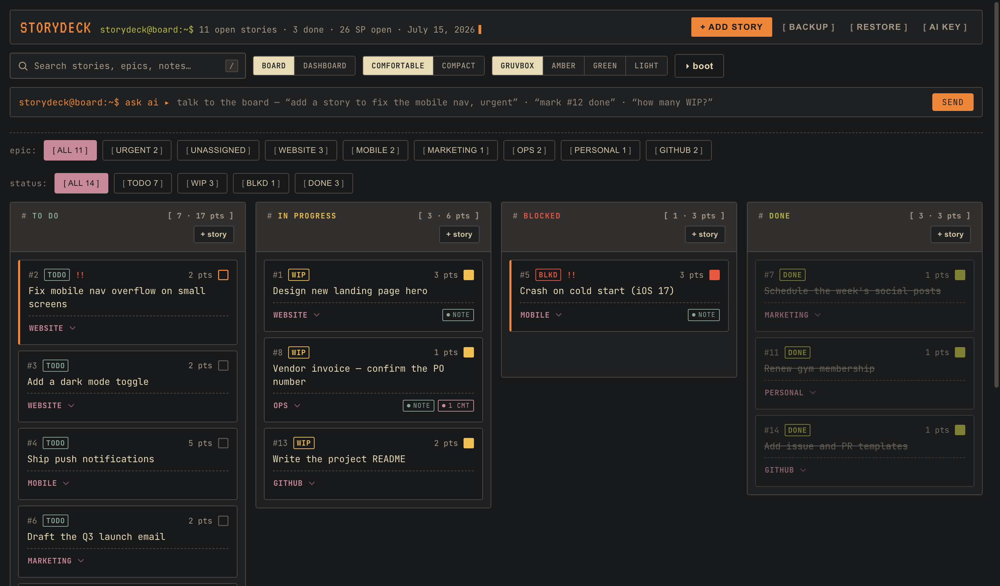
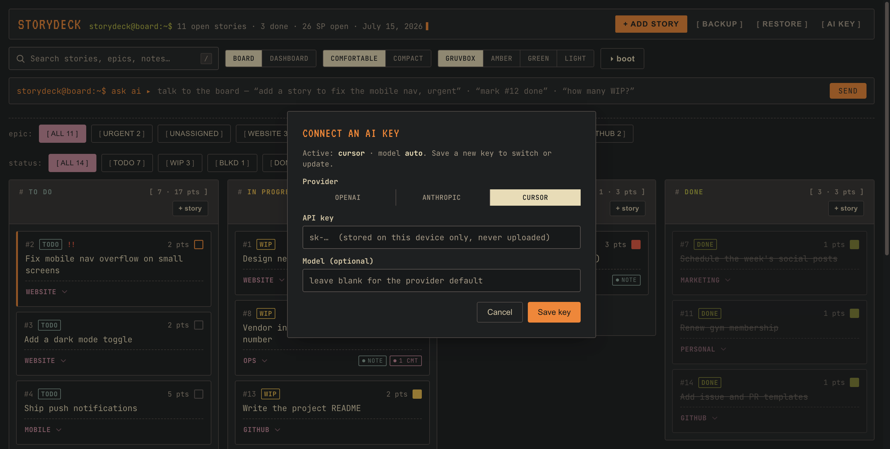

# StoryDeck

A **local-first, retro-terminal Kanban board** for your stories, tasks, and epics.
Runs entirely on your machine — your data lives in a local SQLite file and never
leaves the device. Optional AI assistant, boot screen, dashboard, and four
selectable terminal themes (gruvbox / amber / green / light / mck).



> **Privacy model:** StoryDeck is local-first by design. The board, comments, and
> backups are stored in `data/` on your disk. The only network egress is the
> optional AI assistant, which talks to a single `/api/chat` endpoint using a key
> you provide. No telemetry, no cloud sync.

---

## Features

- **Kanban board** — To Do / In Progress / Blocked / Done, drag-and-drop, reorder.
- **Epics** — group stories into projects; custom epics auto-become filter buttons.
- **Stories** — sprint points, notes, inline comments, urgent flag, per-story status,
  and optional **due dates** with overdue/soon urgency chips.
- **Views** — full board, compact list, and a dashboard with counts, progress bars,
  and a **deadlines** panel (open stories by due date, overdue first).
- **Search & prefilters** — filter by text, by status, or by **due soon** in either view.
- **Boot screen** — a BIOS/POST-style splash with a weekly standup summary.
- **AI assistant** *(optional)* — an agentic "ask" bar that can add, update, comment,
  complete, set due dates, and focus the board via natural language.
- **Backup / Restore** — export or import the whole board as JSON.
- **Desktop app** — runs as an Electron window, or as a plain local web server.

## Quick start

```bash
# 1. Install (Electron is the only dependency, for the desktop window)
npm install

# 2. (Optional) enable the AI assistant
cp env.example .env         # then put your key in CURSOR_API_KEY=

# 3a. Run as a desktop app
npm run app

# 3b. …or run as a local web server and open the URL in a browser
npm start                   # http://127.0.0.1:4321
```

The server binds to `127.0.0.1` only — it is not reachable from the network.

## Data & seeding — public build vs. private overlay

StoryDeck keeps one codebase but walls off real data with a **`private/` overlay**:

- **Public build (this repo):** seeds from the fictional **`data/seed.sample.json`**.
  A fresh clone runs with demo data and commits nothing sensitive.
- **Private overlay (`private/`, gitignored):** if a `private/` folder exists, the
  app reads and writes there instead — `private/data/seed.json` (your real seed),
  `private/data/todo.db` (live DB), `private/backups/`, and `private/.env` (your key
  + `BOARD_TITLE`). Nothing under `private/` is ever committed or pushed.

Because both share the *same code*, the public and private versions are always in
sync by construction — only the data differs.

```
ToDo/
  web/                 # frontend assets served by the server
  src/                 # server, db, ai, env
  data/seed.sample.json  # PUBLIC demo seed (committed)
  private/             # PRIVATE overlay (gitignored) — real data, DB, backups, .env
```

## Download

Grab a prebuilt desktop app from the
[Releases page](https://github.com/coco-research/storydeck/releases) — macOS
(`.dmg`), Windows (`.exe`), or Linux (`.AppImage`). Download, run, and your board
saves automatically to your OS user-data folder. No setup, no server to start.

(Maintainers: push a `v*` tag to trigger the release build — see
`.github/workflows/release.yml`.)

## Download & run (macOS)

Grab the `.dmg` from the
[Releases page](https://github.com/coco-research/storydeck/releases). Currently
**Apple Silicon (arm64) only** — signing, notarization, and Windows/Linux builds
are planned.

1. Open the `.dmg`, drag **StoryDeck** to **Applications**, and launch it.
   The app runs its own local server on `127.0.0.1` (loopback only) — fully
   on-device.

**First launch (unsigned build)** — macOS Gatekeeper will warn because the app is
not yet notarized. One-time fix: in **Applications**, right-click (or
Control-click) **StoryDeck** → **Open** → **Open**. Alternatively:

```bash
xattr -dr com.apple.quarantine "/Applications/StoryDeck.app"
```

On first run the SQLite database is created automatically at
`~/Library/Application Support/StoryDeck/todo.db`, seeded with a sample board.
State persists across launches with no setup.

**Backup / move data:** use the in-app **Export** button (or copy `todo.db`).
Restore via the in-app import.

## Building installers

```bash
npm run pack        # unpacked app in dist/ (fast sanity check, no installer)
npm run dist        # full installers: .dmg/.zip (mac), .exe (win), .AppImage (linux)
```

- **App icon** lives at `build/icon.png` (electron-builder converts it to
  `.icns`/`.ico`). Regenerate it from source with `npx electron tools/make-icon.cjs`.
- **Unsigned builds run**, but the OS warns: on macOS, right-click → **Open** the
  first time (Gatekeeper); on Windows, click **More info → Run anyway**.
- **macOS signing + notarization** (for a warning-free `.dmg`) needs an Apple
  Developer account. electron-builder reads these from the environment:

  | Variable                       | Purpose                                   |
  |--------------------------------|-------------------------------------------|
  | `CSC_LINK`                     | Path/base64 of your `.p12` signing cert   |
  | `CSC_KEY_PASSWORD`             | Password for that cert                    |
  | `APPLE_ID`                     | Apple ID for notarization                 |
  | `APPLE_APP_SPECIFIC_PASSWORD`  | App-specific password for that Apple ID   |
  | `APPLE_TEAM_ID`                | Your Apple Developer Team ID              |

  With those set, `npm run dist` signs and notarizes automatically. **Windows**
  signing uses the same `CSC_LINK` / `CSC_KEY_PASSWORD`. Keep all of these in CI
  secrets — never commit certificates or passwords.

## AI assistant (optional)

The ask bar works with **any one of three providers**: OpenAI, Anthropic/Claude,
or Cursor. The model only ever receives a compact snapshot of the board through
the local `/api/chat` endpoint; the key stays server-side. With no key, the app
runs fully offline and the bar reports disabled.

### Bring your own key

Two ways to connect a key — pick whichever fits:

1. **In-app (easiest, recommended for the desktop app).** Click **AI key** in the
   header, choose your provider, paste the key, and save. It's stored on your
   device only (next to the database, in your OS user-data folder for the packaged
   app) — never uploaded and never committed. This is the no-`.env` path.

   

2. **Env var (handy for `npm start` / servers).** Put the key in `.env`
   (`cp env.example .env`). If several keys are set, the priority is
   OpenAI → Anthropic → Cursor; or force one with `AI_PROVIDER`, and pin a model
   with `AI_MODEL`.

You can check the live status any time at `GET /api/ai/health` — it reports the
active provider and model (and which keys are present) without ever echoing the
key itself.

| Variable            | Purpose                                        | Default                |
|---------------------|------------------------------------------------|------------------------|
| `OPENAI_API_KEY`    | Use OpenAI (Chat Completions)                  | *(unset)*              |
| `ANTHROPIC_API_KEY` | Use Anthropic / Claude (Messages API)          | *(unset)*              |
| `CURSOR_API_KEY`    | Use the Cursor SDK gateway                     | *(unset)*              |
| `AI_PROVIDER`       | Force `openai` \| `anthropic` \| `cursor`      | auto-detect            |
| `AI_MODEL`          | Pin a model id                                 | per-provider default   |
| `BOARD_TITLE`       | Custom board title in the header               | `StoryDeck`            |
| `BOARD_USER`        | Shell-prompt handle (header + ask bar)         | `storydeck`            |
| `BOARD_CORE_EPICS`  | Comma-separated always-on epic filter buttons  | `Website,Mobile,…`     |
| `DB_PATH`           | Override the SQLite file location              | `data/todo.db`         |

## Connect Cursor (MCP) — v1.2+

StoryDeck exposes a **local MCP server** so Cursor can read and update your live
board while the app is running. Everything stays on loopback — no cloud sync.

**Requirements:** StoryDeck **v1.2.0+** installed and running.

1. **One-time setup** (after installing v1.2):

   ```bash
   ./tools/install-mcp.sh
   ```

   This merges a `storydeck` entry into `~/.cursor/mcp.json`. Restart Cursor.

2. **Use it:** Open StoryDeck, then in Cursor ask to list or update your board.
   MCP tools include `storydeck_list`, `storydeck_create`, `storydeck_complete`,
   and more.

**Dev mode** (`npm start`): the installer detects no `/Applications/StoryDeck.app`
and points MCP at this repo with system `node`. Override the API URL with
`STORYDECK_URL=http://127.0.0.1:4321` if needed.

### Updates: reinstall vs hot-update

| What changed | What you do |
|--------------|-------------|
| UI / server JS (`web/`, `src/`) | Quit StoryDeck and reopen — hot-update applies automatically |
| App binary (v1.1 → v1.2, Electron shell) | Reinstall the `.dmg` or run `./tools/update-app.sh` |
| MCP tool tweaks after v1.2 | Usually just relaunch — shipped via hot-update |
| Your stories | Never lost — they live in OS user data, not the app bundle |

## Development

```bash
npm test        # node --test — unit, API, and frontend tests
./tools/shots.sh  # capture screenshots (board / list / dashboard)
```

Tests run against the committed **sample seed**, so they are deterministic in a
clean clone and never depend on private data.

## License

MIT.
